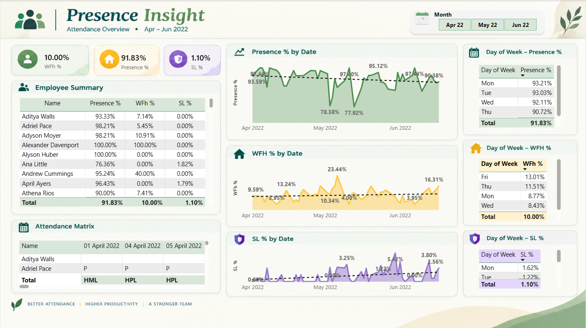

# 📊 HR Analytics Dashboard — Power BI

## 📌 Project Overview

An interactive **HR Analytics Dashboard** developed using **Microsoft Power BI** to analyze workforce information, employee attributes, and attendance data.

This project demonstrates the data analytics workflow from data preparation and transformation to data modeling, DAX calculations, and interactive dashboard development.

## 🎯 Objectives

- Analyze workforce data
- Explore employee attributes
- Analyze attendance patterns
- Identify trends and patterns in HR data
- Build an interactive HR dashboard
- Present data through clear and meaningful visualizations

## 🛠️ Tools & Technologies

- Microsoft Power BI
- Power Query
- DAX
- Microsoft Excel
- Data Cleaning & Transformation
- Data Modeling
- Data Visualization

## 📂 Dataset

The project uses HR and attendance data stored in Excel format.

The data was imported into Power BI and prepared using **Power Query** before analysis and visualization.

## 📊 Dashboard Sections

- Workforce Overview
- Employee Attributes
- Attendance Analysis
- HR Metrics
- Interactive Data Exploration

## 🖥️ Dashboard Preview

### HR Analytics Dashboard — Overview

## 🔄 Data Analytics Workflow

1. Imported data from Excel
2. Cleaned and transformed the data using Power Query
3. Standardized data types and fields
4. Created the Power BI data model
5. Developed calculated measures using DAX
6. Created interactive visualizations
7. Designed the final HR Analytics Dashboard

## 💡 Skills Demonstrated

- Data Cleaning
- Data Transformation
- Exploratory Data Analysis
- Data Modeling
- Power Query
- DAX
- Power BI
- Data Visualization
- Dashboard Development
- Business-oriented Data Analysis

## 📁 Project Files

| File | Description |
|---|---|
| `HR.pbix` | Power BI report containing the dashboard and data model |
| `Attendance-Sheet-2022-2023.xlsx` | Excel attendance dataset |
| `screenshots/` | Dashboard preview images |

## 🚀 How to Use

1. Download the `.pbix` file and required Excel dataset.
2. Open the `.pbix` file using **Power BI Desktop**.
3. If Power BI cannot locate the Excel dataset, update the data source path to the downloaded Excel file.
4. Refresh the data if required.
5. Explore the interactive dashboard using the available filters and visualizations.

## 👨‍💻 Author

**Yadhav V N**

B.Tech Computer Science Engineering

Aspiring Data Analyst

**Skills:** Power BI · SQL · Python · Excel · Data Analytics

---

⭐ This project was created as part of my Data Analytics portfolio to demonstrate practical skills in Power BI and data analysis.
